# Contributing to sk_pqc

Thanks for helping with `sk_pqc` — a sovereign **hybrid post-quantum KEM** for Dart
and Flutter (suite `x25519-mlkem768`: X25519 + ML-KEM-768, FIPS 203). This is
cryptographic infrastructure, so the bar is higher than a typical package: changes are
gated on **cross-implementation vector agreement**, and the project's honest-claim
rules are **non-negotiable**.

By participating you agree to the [Code of Conduct](CODE_OF_CONDUCT.md). All
contributions are licensed under **Apache-2.0**.

---

## Ground rules (read before you write code)

These come straight from the SKStacks
[CRYPTOGRAPHY_STANDARD](https://github.com/smilinTux/skstacks/blob/main/docs/CRYPTOGRAPHY_STANDARD.md)
and are enforced in review:

1. **We bind vetted crypto; we never hand-roll primitives.** The lattice and curve
   math come from **liboqs**, **@noble/post-quantum**, and `package:cryptography`. The
   **only** original cryptographic code is the HKDF-SHA256 combiner
   (`lib/src/combiner.dart`). Do not add a second hand-written primitive.
2. **The combiner is frozen.** `HKDF-SHA256(X25519_ss ‖ MLKEM768_ss)`, X25519 first,
   concatenate-then-KDF — **never XOR, never pure-PQ**. Changing it (or the byte
   order, or the fixed wire-format lengths) breaks every peer and requires a
   **suite-id bump**, not a silent edit.
3. **One API, two backends.** New functionality goes behind the single `HybridKem`
   interface and must work identically on web (noble) and native (liboqs). Don't fork
   the API per platform — the conditional import in the `MlKem` provider is the only
   place platforms diverge.
4. **Honest claims only.** In code, comments, docs, and commit messages: say
   **"quantum-resistant"** / **"post-quantum,"** never "quantum-proof,"
   "quantum-safe," or "unbreakable." Every claim cites **surface + FIPS number +
   hybrid-vs-classical**. This package is **KEM-only** — never imply it authenticates.
5. **No claim without a test.** Every cryptographic behaviour is backed by a vector or
   KAT. If you can't test it, it doesn't ship.

---

## Development workflow

```mermaid
flowchart LR
    A["Open an issue / discuss<br/>(for any crypto-surface change)"] --> B["Branch from main"]
    B --> C["Write the test FIRST<br/>(combiner KAT / cross-backend / property)"]
    C --> D["Implement behind HybridKem / MlKem"]
    D --> E["dart format && dart analyze"]
    E --> F["dart test (local: combiner KATs)"]
    F --> G["With liboqs + noble:<br/>full cross-backend + vector suite"]
    G --> H{"Touched combiner<br/>or wire format?"}
    H -->|"yes"| I["Re-run tool/verify_vector.py<br/>(Python ↔ Dart ↔ liboqs ↔ noble agree)"]
    H -->|"no"| J["Open PR"]
    I --> J
    J --> K["Review: honest-claim + vector gate"]
    style C fill:#51cf66,stroke:#2b8a3e,stroke-width:2px
    style I fill:#f59e0b,stroke:#d97706,stroke-width:2px
    style K fill:#4a90e2,stroke:#1e3a8a,stroke-width:2px,color:#fff
```



### Setup

```bash
git clone https://github.com/smilinTux/sk-pqc-dart
cd sk_pqc
dart pub get
```

For the **native** path, build liboqs 0.14.0 (see [SOP.md](SOP.md) §Build/Deploy) and
export `SK_PQC_LIBOQS`. For **cross-backend** tests, point `SK_PQC_NOBLE_DIR` at a
noble checkout with node available.

### Run the checks

```bash
dart format --output=none --set-exit-if-changed .   # formatting
dart analyze                                         # lints (analysis_options.yaml)

# Combiner KATs run anywhere; FFI + cross-backend skip cleanly without liboqs/noble.
LD_LIBRARY_PATH=$HOME/.local/lib \
SK_PQC_LIBOQS=$HOME/.local/lib/liboqs.so \
SK_PQC_NOBLE_DIR=/path/to/noble \
dart test

# If you touched the combiner or wire format, the Python contract MUST still hold:
python3 tool/verify_vector.py   # expect "MATCH: True"
```

---

## What a good PR looks like

- **Scoped.** One logical change. Crypto-surface changes are discussed in an issue
  first.
- **Tested.** New behaviour has a vector/KAT in `test/`. Bug fixes add a regression
  test that fails before, passes after.
- **Green vectors.** The cross-impl vector
  (`test_vectors/hybrid_kem_x25519_mlkem768.json`) still recovers identically across
  Dart (native + web), liboqs, noble, and Python.
- **Honest.** No new claim exceeds the evidence; no forbidden words; KEM-only scope
  respected.
- **Documented.** README / SOP / CHANGELOG updated when behaviour or interop changes.

### Especially welcome

- **Per-platform native binary bundling** (Android/iOS/macOS/Windows liboqs via a
  Flutter FFI plugin + CI matrix) — the documented #1 follow-up.
- More **cross-impl vectors** (additional ACVP-anchored cases; more verifier languages).
- Hardening the web bootstrap and pinning audited noble versions.
- Clearer self-report hooks so consumers can prove `hybrid x25519-mlkem768 / FIPS 203`
  per channel.

### Out of scope (by design)

- **Signatures** (ML-DSA / SLH-DSA, tier T3) — future work, not this package.
- A **third** hand-written primitive, or replacing a bound library with home-grown math.
- **CNSA-2.0 / ML-KEM-1024** as the default — reserved for a sovereign root, not the
  internet-default -768 tier.
- Any change that makes a **web** client claim E2E post-quantum assurance.

---

## Release (maintainers)

Releases are gated on the cross-impl vector suite — see [SOP.md](SOP.md) §(c):

1. Bump `version:` in `pubspec.yaml` + add a `CHANGELOG.md` entry.
2. `dart pub get && dart test` (combiner KATs + ML-KEM KAT + cross-backend + vector).
3. `dart pub publish --dry-run` (confirm wire-format lengths unchanged).
4. `dart pub publish` → pub.dev.
5. `git tag vX.Y.Z && git push --tags`.

A wire-format or combiner change is **never** a patch release — it ships under a new
suite id with all verifiers updated in lockstep.

---

## Reporting security issues

**Do not** open a public issue for a vulnerability. Follow [SECURITY.md](SECURITY.md)
(private GitHub Security Advisory or maintainer email, coordinated disclosure).

---

## Commits

Conventional, imperative subject lines (`fix:`, `feat:`, `test:`, `docs:`). Reference
the issue. Keep crypto-surface changes isolated from refactors so review can focus.

Thanks for keeping the crypto honest. 🐧 **SK = staycuriousANDkeepsmilin**
