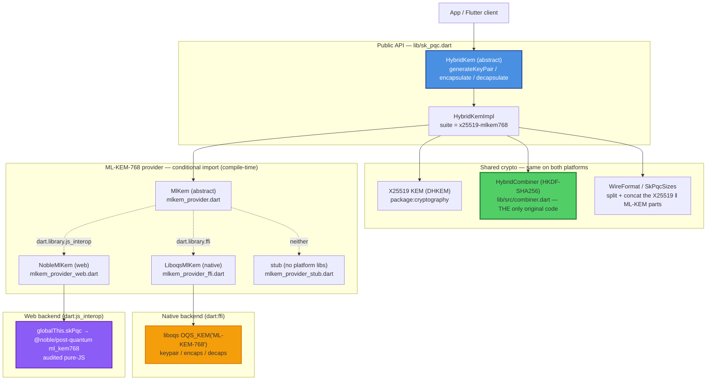
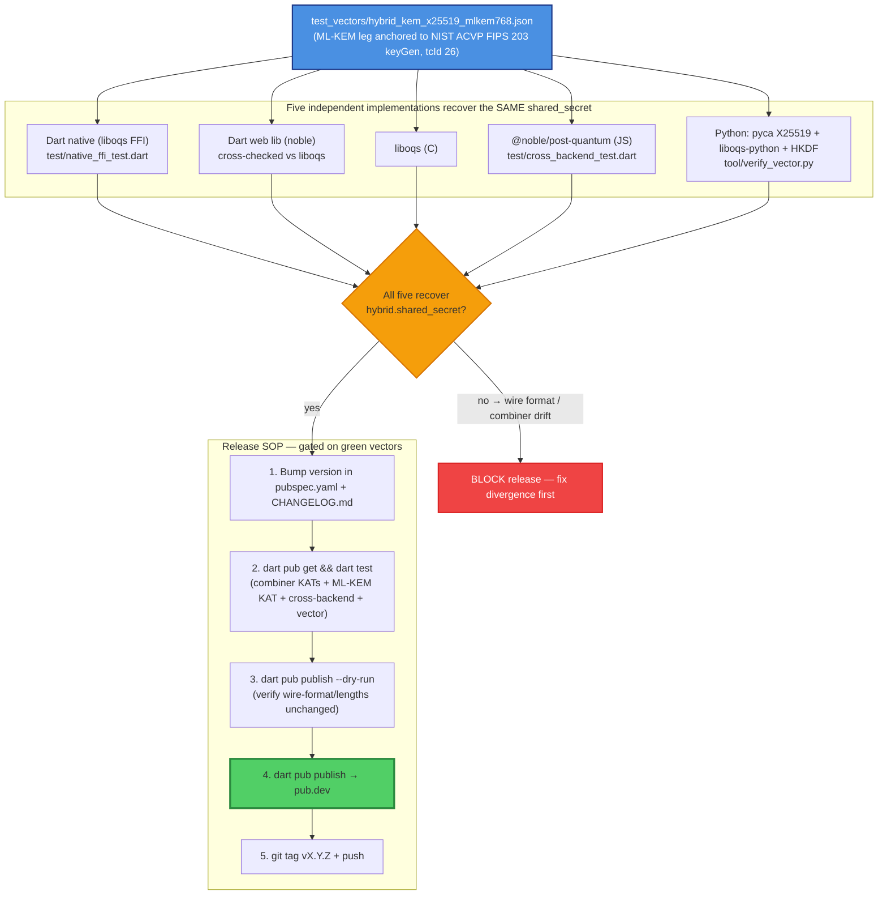

# sk_pqc — Standard Operating Procedures

`sk_pqc` is a sovereign **hybrid post-quantum key-encapsulation** library for Dart
and Flutter. It exposes **one** `HybridKem` Dart API and runs the **same** suite —
**`x25519-mlkem768`** (X25519 + ML-KEM-768, FIPS 203) — on **web** and **native**
behind a conditional import. The only original cryptographic code is the
**HKDF-SHA256 hybrid combiner**; the lattice and curve primitives are **bound, never
hand-rolled** (liboqs on native, `@noble/post-quantum` on web, `package:cryptography`
for X25519 on both).

**Maturity tier:** **T2 — Hybrid KEM** for key exchange (the `HKDF(X25519 ‖ MLKEM768)`
combiner neutralises Harvest-Now-Decrypt-Later on anything that wraps a key through
it). It is **KEM-only and honest about it** — signatures (ML-DSA / SLH-DSA, T3) are
**out of scope / future work**. This package authenticates nothing by itself.

**Honest-claim posture (non-negotiable, per the SKStacks
[CRYPTOGRAPHY_STANDARD](https://github.com/smilinTux/skstacks/blob/main/docs/CRYPTOGRAPHY_STANDARD.md)):**

- This is **quantum-resistant** / **post-quantum**. It is **never**
  "quantum-proof," "quantum-safe," or "unbreakable."
- Hybrid means the derived secret is **secure if *either* leg holds** — a quantum
  break of X25519 still leaves ML-KEM-768; a lattice break of ML-KEM-768 falls back
  to classical X25519. We **combine**, never replace.
- It targets the **FIPS 203 ML-KEM-768** tier (the internet default, matching TLS
  `X25519MLKEM768` and Signal PQXDH). It is **not** the CNSA-2.0 ceiling
  (ML-KEM-1024) — that tier is reserved for a sovereign root.
- Every external claim must cite **surface + FIPS number + hybrid-vs-classical**.
- **No web client may claim it is E2E post-quantum**: WebCrypto has no PQC API in any
  browser (2026), so the web leg's assurance is *disclosed* as resting on the audited
  pure-JS `@noble/post-quantum`.

**Standards anchored:** FIPS 203 (ML-KEM), FIPS 204/205 (ML-DSA/SLH-DSA — future
work, cited for scope), RFC 5869 (HKDF), RFC 7748 (X25519), RFC 9180 (HPKE / DHKEM
construction for the X25519 leg), NIST CSWP 39 (crypto-agility). License: **Apache-2.0**.

---

## Architecture

### (a) One `HybridKem` API → two backends (web / native)

A single Dart interface is implemented once and dispatched to one of two ML-KEM
providers chosen **at compile time** by conditional import
(`if (dart.library.ffi) … else if (dart.library.js_interop) …`). The X25519 leg and
the HKDF combiner are **identical** on both platforms — only the ML-KEM-768 provider
swaps. This is the `CryptoBackend`-style abstraction the standard mandates: policy
(the suite) is fixed, mechanism (the binding) is selected per target.



| Layer | File(s) | Bound library | Hand-rolled? |
|---|---|---|---|
| Public API | `lib/sk_pqc.dart`, `lib/src/hybrid_kem.dart`, `lib/src/hybrid_kem_impl.dart` | — | no (orchestration) |
| **Combiner** | `lib/src/combiner.dart` (`HybridCombiner`) | HKDF from `package:cryptography` | **the only original crypto** |
| X25519 leg | `lib/src/x25519_kem.dart` | `package:cryptography` (RFC 7748) | no |
| ML-KEM provider iface | `lib/src/mlkem_provider.dart`, `mlkem_backend.dart` | — | no |
| Native ML-KEM | `lib/src/mlkem_provider_ffi.dart` (`LiboqsMlKem`) | **liboqs** (`OQS_KEM`) | no |
| Web ML-KEM | `lib/src/mlkem_provider_web.dart` (`NobleMlKem`) | **@noble/post-quantum** `ml_kem768` | no |
| Wire format | `lib/src/types.dart` (`WireFormat`, `SkPqcSizes`, `SkPqcError`) | — | no |

### (b) The X25519 + ML-KEM-768 HKDF combiner — encapsulate / decapsulate flow

Both legs run independently; their shared secrets are **concatenated (X25519 first),
then fed through HKDF-SHA256** to produce the 32-byte hybrid secret. The X25519 leg
is an **ephemeral-static DHKEM** (HPKE/TLS style): the encapsulator ships a fresh
ephemeral public key as its 32-byte "ciphertext." The ML-KEM-768 leg is exactly
FIPS 203 and uses **implicit rejection** — a tampered ciphertext does **not** throw;
it yields a pseudo-random secret that simply won't match.

```mermaid
sequenceDiagram
    autonumber
    participant E as Encapsulator
    participant K as HybridKem (suite x25519-mlkem768)
    participant D as Decapsulator (holds private key)

    Note over D: generateKeyPair()
    D->>D: X25519 static keypair (seed 32B)
    D->>D: ML-KEM-768 keypair (pk 1184B / sk 2400B)
    D-->>E: publicKey = X25519_pub(32) ‖ MLKEM_pub(1184) = 1216B

    Note over E: encapsulate(publicKey)
    E->>E: split publicKey → X25519_pub, MLKEM_pub  (WireFormat)
    E->>E: X25519 leg: fresh ephemeral kp; ss_x = DH(eph_priv, X25519_pub)
    E->>E: ML-KEM leg: (ct_m, ss_m) = ML-KEM.Encaps(MLKEM_pub)
    E->>K: combine(ss_x ‖ ss_m)
    K-->>E: ss = HKDF-SHA256(IKM=ss_x‖ss_m, salt, info="sk_pqc/x25519-mlkem768/v1", L=32)
    E-->>D: ciphertext = eph_pub(32) ‖ ct_m(1088) = 1120B
    Note over E: use ss as AES-256-GCM / ChaCha20 key (32B)

    Note over D: decapsulate(ciphertext, privateKey)
    D->>D: split ciphertext → eph_pub, ct_m  (WireFormat)
    D->>D: X25519 leg: ss_x = DH(X25519_priv, eph_pub)
    D->>D: ML-KEM leg: ss_m = ML-KEM.Decaps(ct_m, MLKEM_sk)  [implicit rejection]
    D->>K: combine(ss_x ‖ ss_m)
    K-->>D: ss' = HKDF-SHA256(...)
    Note over D: ss' == ss  ⇔ both legs matched
```

**The combiner — the one rule that must never deviate:**

```
shared_secret = HKDF-SHA256( IKM  = X25519_ss ‖ MLKEM768_ss,   // X25519 part FIRST
                             salt = "" (RFC 5869 → HashLen zero bytes),
                             info = "sk_pqc/x25519-mlkem768/v1" | <context label>,
                             L    = 32 )
```

- `‖` is byte concatenation, **X25519 first**. **Concatenate-then-KDF. Never XOR. Never pure-PQ.**
- Pass a context label as `info` (e.g. a channel id) for domain separation.
- Verified in `test/combiner_test.dart` against **RFC 5869 §A.1** known answers plus
  hand-computed vectors, with salt/info domain-separation and wrong-length rejection.

**Wire format — the interop contract (lengths are FIXED, MUST NOT change):**

| Element | Layout | Bytes |
|---|---|---|
| public key | `X25519_pub(32)` ‖ `MLKEM768_pub(1184)` | **1216** |
| private key | `X25519_priv_seed(32)` ‖ `MLKEM768_secret(2400)` | **2432** |
| ciphertext | `X25519_ephemeral_pub(32)` ‖ `MLKEM768_ct(1088)` | **1120** |
| shared secret | `HKDF-SHA256(...)` | **32** |

### (c) Cross-impl-vector test / release flow

The interop contract is enforced by a **single machine-readable vector**
(`test_vectors/hybrid_kem_x25519_mlkem768.json`) that **every** conformant
implementation MUST recover identically. The ML-KEM-768 leg keypair is derived from
the **NIST ACVP FIPS 203 keyGen** seed (`d ‖ z`, tcId 26), anchoring it to an
official known-answer. The gate to `dart pub publish` is: combiner KATs + ML-KEM KAT
+ cross-backend agreement (Dart native ↔ Dart web ↔ liboqs ↔ noble ↔ Python) all green.



---

## Build / Deploy

`sk_pqc` is a **published Dart package** (pub.dev), not a deployed service. "Deploy"
means: (1) build the native ML-KEM binary per target, or (2) provide the web JS dep.

### Native (dart:ffi → liboqs)

Provide the **liboqs shared library** at runtime. Lookup order: `SK_PQC_LIBOQS` env
path → platform default names (`liboqs.so`, `liboqs.so.N`, `liboqs.dylib`,
`oqs.dll`) → `~/.local/lib`, `/usr/local/lib`, `/usr/lib`. Proven on Linux desktop
with **liboqs 0.14.0**:

```bash
git clone --branch 0.14.0 https://github.com/open-quantum-safe/liboqs
cmake -GNinja -DBUILD_SHARED_LIBS=ON -DOQS_BUILD_ONLY_LIB=ON \
      -DCMAKE_INSTALL_PREFIX=$HOME/.local -S liboqs -B liboqs/build
ninja -C liboqs/build install
export SK_PQC_LIBOQS=$HOME/.local/lib/liboqs.so
```

**Per-platform bundling (CI follow-up — the #1 runtime failure is a missing binary):**

| Platform | liboqs artifact | Bundling |
|---|---|---|
| Linux desktop | `liboqs.so` | system lib / app dir (done) |
| Android | `liboqs.so` per ABI (arm64-v8a, armeabi-v7a, x86_64) | `jniLibs/` via Gradle / Flutter FFI plugin |
| iOS / macOS | `liboqs.a` / `.dylib` (arm64, x86_64) | XCFramework in a CocoaPods/SwiftPM plugin |
| Windows | `oqs.dll` (x64, arm64) | bundled next to the executable |

Wrap as a Flutter FFI plugin so the build fetches/builds the right binary per target
(a GitHub Actions matrix building liboqs per ABI).

### Web (dart:js_interop → noble-post-quantum)

WebCrypto has **no** PQC API in any browser (2026), so app-layer ML-KEM must come
from JS. Expose `globalThis.skPqc` before your app loads — a ready bootstrap ships at
`web/sk_pqc_noble_bootstrap.js`. Delivery options: **bundle** with esbuild/rollup +
`<script type="module">` in `web/index.html` (recommended — pin the audited version),
**CDN/import-map** to esm.sh/jsdelivr, or **vendor** the bundle as a web asset.

```js
import { ml_kem768 } from '@noble/post-quantum/ml-kem.js';
globalThis.skPqc = {
  keygen()            { const k = ml_kem768.keygen();
                        return { publicKey: k.publicKey, secretKey: k.secretKey }; },
  encapsulate(pk)     { const e = ml_kem768.encapsulate(pk);
                        return { cipherText: e.cipherText, sharedSecret: e.sharedSecret }; },
  decapsulate(ct, sk) { return ml_kem768.decapsulate(ct, sk); },
};
```

### Front-end / Exposure

Per [sk-standards `UNIFIED_INGRESS_STANDARD.md`](https://github.com/smilinTux/sk-standards/blob/main/standards/UNIFIED_INGRESS_STANDARD.md):
**N/A — no network surface (library).** `sk_pqc` is a published pub.dev package; it has no
daemon, port, or listener and answers no public `:443` route.

---

## Config

| Knob | Where | Effect |
|---|---|---|
| `SK_PQC_LIBOQS` | env (native) | absolute path to the liboqs shared lib (highest-priority lookup) |
| `LD_LIBRARY_PATH` | env (native) | dynamic-loader search path for liboqs |
| `SK_PQC_NOBLE_DIR` | env (cross-backend tests) | path to a noble checkout for node-based cross-checks |
| `globalThis.skPqc` | web runtime | the JS shim binding `@noble/post-quantum` ml_kem768 |
| `info` arg | `encapsulate` / `decapsulate` call | HKDF domain-separation context label (default `sk_pqc/x25519-mlkem768/v1`) |

---

## API / Usage Reference

```dart
import 'package:sk_pqc/sk_pqc.dart';

final kem  = HybridKemImpl();                 // backend auto-selected (web/native)
final keys = await kem.generateKeyPair();     // HybridKeyPair: publish keys.publicKey (1216B)
final enc  = await kem.encapsulate(keys.publicKey); // EncapResult: .ciphertext(1120B), .sharedSecret(32B)
final ss   = await kem.decapsulate(enc.ciphertext, keys.privateKey); // == enc.sharedSecret
// use the 32-byte ss as an AES-256-GCM / ChaCha20 key
```

| Member | Signature | Notes |
|---|---|---|
| `HybridKem.generateKeyPair()` | `Future<HybridKeyPair>` | `publicKey` 1216B, `privateKey` 2432B |
| `HybridKem.encapsulate(pub)` | `Future<EncapResult>` | `.ciphertext` 1120B, `.sharedSecret` 32B |
| `HybridKem.decapsulate(ct, priv)` | `Future<Uint8List>` | 32B; matches encapsulator iff both legs agree |
| failure modes | — | malformed key/ct → `SkPqcError` (**never crashes**); tampered ML-KEM ct → implicit rejection (mismatched secret, no throw) |

**Python interop (forward-looking).** `tool/verify_vector.py` re-derives the shared
secret from the vector using pyca X25519 + liboqs-python + HKDF-SHA256 — the exact
contract the SK `pqkem.py` (PQC-MIGRATION Q1) must satisfy so Dart↔Python vectors agree:

```bash
python3 tool/verify_vector.py
# derived shared : f11627140207d95e0b743245f5c6381e08c30dc61cc84abf03a822c888ce21fc
# MATCH: True
```

---

## Testing

```bash
dart pub get

# Combiner KATs run anywhere. Native FFI + cross-backend tests need liboqs
# (and, for cross-backend, node + @noble/post-quantum); they skip cleanly if absent.
LD_LIBRARY_PATH=$HOME/.local/lib \
SK_PQC_LIBOQS=$HOME/.local/lib/liboqs.so \
SK_PQC_NOBLE_DIR=/path/to/noble \
dart test
```

| Suite | File | Covers |
|---|---|---|
| Combiner vectors | `test/combiner_test.dart` | HKDF-SHA256 vs RFC 5869 §A.1 + hand-computed; salt/info domain separation; wrong-length rejection |
| ML-KEM-768 KAT | `test/native_ffi_test.dart` | decapsulating the FIPS 203 / NIST ACVP-anchored vector yields the standard secret |
| Cross-backend | `test/cross_backend_test.dart` | noble ↔ liboqs both directions; both decapsulate the shared interop vector identically |
| Round-trip + property | (above) | generate → encapsulate → decapsulate; two encaps to the same key differ |
| Failure cases | (above) | malformed keys/ct throw `SkPqcError`; tampered ML-KEM ct → implicit rejection |

---

## Troubleshooting

| Symptom | Likely cause | Fix |
|---|---|---|
| `SkPqcError: liboqs not found` | native lib not on lookup path | set `SK_PQC_LIBOQS` to the absolute `liboqs.so`; or place it in `~/.local/lib` / `/usr/local/lib`; check `LD_LIBRARY_PATH` |
| native FFI tests skip silently | no liboqs present | expected — build liboqs 0.14.0 (see Build/Deploy) to enable |
| web: `skPqc is undefined` | JS dep not exposed before app load | bundle/import `web/sk_pqc_noble_bootstrap.js` and set `globalThis.skPqc` |
| cross-backend tests skip | `SK_PQC_NOBLE_DIR` / node missing | point `SK_PQC_NOBLE_DIR` at a noble checkout with node available |
| `decapsulate` secret never matches | tampered/truncated ciphertext, or peer used a different `info` | ML-KEM implicit rejection is silent — confirm wire-format lengths (1120B ct) and identical `info` on both sides |
| `SkPqcError: bad length` | wrong-sized key/ct on the wire | verify 1216B pub / 2432B priv / 1120B ct — these are fixed and version-pinned |
| Python vector MISMATCH | combiner drift (XOR, wrong order, wrong info) | combiner MUST be `HKDF-SHA256(X25519_ss ‖ MLKEM_ss)`, X25519 first; rerun `tool/verify_vector.py` |
| publish blocked: vectors red | wire-format or combiner change | **do not publish** — divergence breaks every peer; revert or coordinate a suite-id bump |

---

## Tier reference

| Tier | Meaning | `sk_pqc` status |
|---|---|---|
| **T0 — Classical** | asymmetric crypto is classical (X25519/Ed25519/RSA) | superseded for KEM |
| **T1 — Agile** | suite-ids + registry + backend ABC + self-report | ✅ suite id `x25519-mlkem768`, one backend ABC, conditional-import providers |
| **T2 — Hybrid KEM** | key exchange uses `HKDF(X25519 ‖ MLKEM768)`; HNDL neutralised | ✅ **this is `sk_pqc`'s tier** |
| **T3 — Hybrid sig** | signatures use ML-DSA-65 + Ed25519 (additive) | ❌ out of scope — future work |
| **T4 — Transport closed** | edge-to-origin TLS hybrid; residual classical legs documented | n/a (library, not transport) |

**Self-report obligation:** a consuming component MUST be able to report, per live
channel, the negotiated KEM (`x25519-mlkem768`) and **hybrid-vs-classical**, citing
**FIPS 203** — that self-report is what turns every claim into evidence rather than
assertion (CRYPTOGRAPHY_STANDARD §5).

---

**SK = staycuriousANDkeepsmilin 🐧** — *sk_pqc: hybrid post-quantum KEM, honest about KEM-only.*
