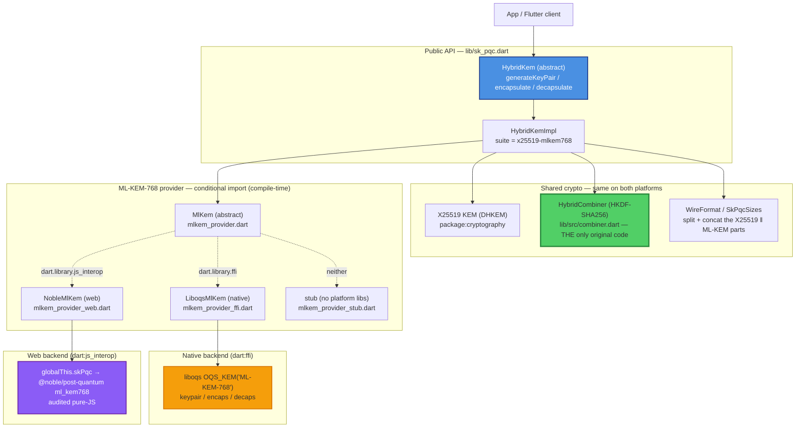
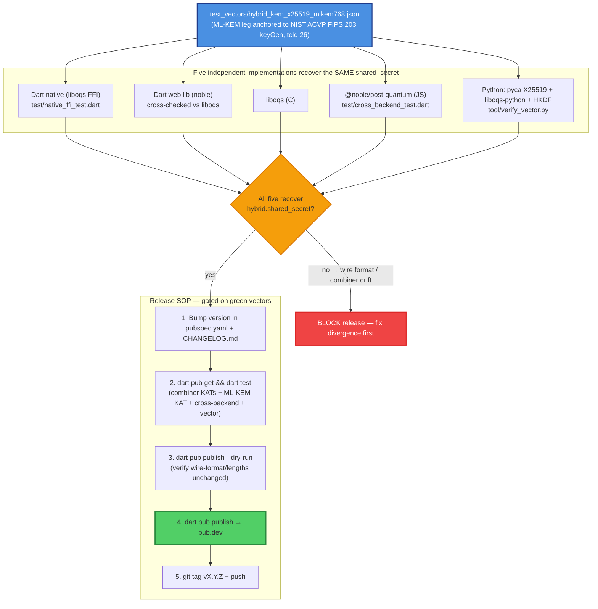

# sk_pqc - Standard Operating Procedures

`sk_pqc` is a sovereign **hybrid post-quantum key-encapsulation** library for Dart and
Flutter. It exposes **one** `HybridKem` API and runs the **same** suite,
**`x25519-mlkem768`** (X25519 + ML-KEM-768, FIPS 203), on **web** and **native** behind
a conditional import. Callers: Flutter/Dart clients in the SK ecosystem that need a
post-quantum key wrap.

---

## 1. Overview

### Purpose and scope

`sk_pqc` derives a **32-byte hybrid shared secret** that two parties can agree on
without either one being able to compute it from a classical break alone. The only
original cryptographic code is the **HKDF-SHA256 hybrid combiner**; the lattice and
curve primitives are **bound, never hand-rolled** (liboqs on native,
`@noble/post-quantum` on web, `package:cryptography` for X25519 on both).

### What it owns

- The `HybridKem` Dart API and its two conditional-import backends (web / native).
- **The combiner**, `HKDF-SHA256(IKM = X25519_ss || MLKEM768_ss)`, X25519 first. This
  is the interop contract with the `sk-pqc-py` and `sk-pqc-rs` siblings.
- The wire-format sizes and the suite id `x25519-mlkem768`.
- A thin DM epoch-ratchet bridge (`lib/src/dm_ratchet.dart`).

### What it explicitly does NOT do

- **It authenticates nothing.** This is a KEM. It provides no signatures, no identity
  binding, and no peer authentication. An unauthenticated KEM is trivially
  machine-in-the-middled: **you must authenticate the public keys out of band.**
- **No signatures.** ML-DSA / SLH-DSA (T3) are out of scope and are not planned here.
- **No transport, no session, no key storage.** Those belong to the consuming app.
- **No self-report.** See section 9: the self-report obligation is discharged by the
  **consumer**, not by this package.

### Maturity tier

**T2, Hybrid KEM** for key exchange. The combiner neutralises Harvest-Now-Decrypt-Later
on anything that wraps a key through it. Full per-axis detail and the version
reference are in **section 9**.

### Honest-claim posture (non-negotiable)

Per [sk-standards `standards/CRYPTOGRAPHY_STANDARD.md`](https://github.com/smilinTux/sk-standards/blob/main/standards/CRYPTOGRAPHY_STANDARD.md):

- This is **quantum-resistant** / **post-quantum**. It is **never** "quantum-proof",
  "quantum-safe", or "unbreakable".
- Hybrid means the derived secret is **secure if *either* leg holds**. A quantum break
  of X25519 still leaves ML-KEM-768; a lattice break of ML-KEM-768 falls back to
  classical X25519. We **combine**, never replace.
- It targets the **FIPS 203 ML-KEM-768** parameter set (the internet default, matching
  TLS `X25519MLKEM768` and Signal PQXDH). It is **not** the CNSA-2.0 ceiling
  (ML-KEM-1024); that is reserved for a sovereign root. Note this is an **algorithm
  parameter set**, not the T0-T4 maturity tier in section 9. The two are different
  scales and are easy to confuse.
- Every external claim must cite **surface + FIPS number + hybrid-vs-classical**.
- **No web client may claim it is end-to-end post-quantum.** WebCrypto has no PQC API
  in any browser (2026), so the web leg's assurance is *disclosed* as resting on the
  audited pure-JS `@noble/post-quantum`.
- AES-256 is **not** quantum-broken. It is symmetric, and Grover only halves the
  effective strength.

**Standards anchored:** FIPS 203 (ML-KEM), FIPS 204/205 (ML-DSA/SLH-DSA, cited only to
scope them **out**), RFC 5869 (HKDF), RFC 7748 (X25519), RFC 9180 (HPKE / DHKEM
construction for the X25519 leg), NIST CSWP 39 (crypto-agility). License:
**Apache-2.0**.

---

## 2. Architecture

### (a) One `HybridKem` API → two backends (web / native)

A single Dart interface is implemented once and dispatched to one of two ML-KEM
providers chosen **at compile time** by conditional import
(`if (dart.library.ffi) … else if (dart.library.js_interop) …`). The X25519 leg and
the HKDF combiner are **identical** on both platforms — only the ML-KEM-768 provider
swaps. This is the `CryptoBackend`-style abstraction the standard mandates: policy
(the suite) is fixed, mechanism (the binding) is selected per target.


```mermaid
graph TB
    APP["App / Flutter client"]

    subgraph API["Public API — lib/sk_pqc.dart"]
        HK["HybridKem (abstract)<br/>generateKeyPair / encapsulate / decapsulate"]
        IMPL["HybridKemImpl<br/>suite = x25519-mlkem768"]
    end

    subgraph SHARED["Shared crypto — same on both platforms"]
        X["X25519 KEM (DHKEM)<br/>package:cryptography"]
        C["HybridCombiner (HKDF-SHA256)<br/>lib/src/combiner.dart — THE only original code"]
        W["WireFormat / SkPqcSizes<br/>split + concat the X25519 ‖ ML-KEM parts"]
    end

    subgraph SEL["ML-KEM-768 provider — conditional import (compile-time)"]
        PROV["MlKem (abstract)<br/>mlkem_provider.dart"]
        FFI["LiboqsMlKem (native)<br/>mlkem_provider_ffi.dart"]
        WEB["NobleMlKem (web)<br/>mlkem_provider_web.dart"]
        STUB["stub (no platform libs)<br/>mlkem_provider_stub.dart"]
    end

    subgraph NATIVE["Native backend (dart:ffi)"]
        OQS["liboqs OQS_KEM('ML-KEM-768')<br/>keypair / encaps / decaps"]
    end
    subgraph WEBJS["Web backend (dart:js_interop)"]
        NOBLE["globalThis.skPqc → @noble/post-quantum ml_kem768<br/>audited pure-JS"]
    end

    APP --> HK --> IMPL
    IMPL --> X
    IMPL --> PROV
    IMPL --> C
    IMPL --> W
    PROV -. "dart.library.ffi" .-> FFI --> OQS
    PROV -. "dart.library.js_interop" .-> WEB --> NOBLE
    PROV -. "neither" .-> STUB

    style C fill:#51cf66,stroke:#2b8a3e,stroke-width:3px
    style HK fill:#4a90e2,stroke:#1e3a8a,stroke-width:2px,color:#fff
    style OQS fill:#f59e0b,stroke:#d97706,stroke-width:2px
    style NOBLE fill:#8b5cf6,stroke:#6b21a8,stroke-width:2px,color:#fff
```

| Layer | File(s) | Bound library | Hand-rolled? |
|---|---|---|---|
| Public API | `lib/sk_pqc.dart`, `lib/src/hybrid_kem.dart`, `lib/src/hybrid_kem_impl.dart` | — | no (orchestration) |
| **Combiner** | `lib/src/combiner.dart` (`HybridCombiner`) | HKDF from `package:cryptography` | **the only original crypto** |
| X25519 leg | `lib/src/x25519_kem.dart` | `package:cryptography` (RFC 7748) | no |
| ML-KEM provider iface | `lib/src/mlkem_provider.dart`, `mlkem_backend.dart` | — | no |
| Native ML-KEM | `lib/src/mlkem_provider_ffi.dart` (`LiboqsMlKem`) | **liboqs** (`OQS_KEM`) | no |
| Web ML-KEM | `lib/src/mlkem_provider_web.dart` (`NobleMlKem`) | **@noble/post-quantum** `ml_kem768` | no |
| Wire format | `lib/src/types.dart` (`WireFormat`, `SkPqcSizes`, `SkPqcError`) | — | no |

### (b) The X25519 + ML-KEM-768 HKDF combiner — encapsulate / decapsulate flow

Both legs run independently; their shared secrets are **concatenated (X25519 first),
then fed through HKDF-SHA256** to produce the 32-byte hybrid secret. The X25519 leg
is an **ephemeral-static DHKEM** (HPKE/TLS style): the encapsulator ships a fresh
ephemeral public key as its 32-byte "ciphertext." The ML-KEM-768 leg is exactly
FIPS 203 and uses **implicit rejection** — a tampered ciphertext does **not** throw;
it yields a pseudo-random secret that simply won't match.

```mermaid
sequenceDiagram
    autonumber
    participant E as Encapsulator
    participant K as HybridKem (suite x25519-mlkem768)
    participant D as Decapsulator (holds private key)

    Note over D: generateKeyPair()
    D->>D: X25519 static keypair (seed 32B)
    D->>D: ML-KEM-768 keypair (pk 1184B / sk 2400B)
    D-->>E: publicKey = X25519_pub(32) ‖ MLKEM_pub(1184) = 1216B

    Note over E: encapsulate(publicKey)
    E->>E: split publicKey → X25519_pub, MLKEM_pub  (WireFormat)
    E->>E: X25519 leg: fresh ephemeral kp; ss_x = DH(eph_priv, X25519_pub)
    E->>E: ML-KEM leg: (ct_m, ss_m) = ML-KEM.Encaps(MLKEM_pub)
    E->>K: combine(ss_x ‖ ss_m)
    K-->>E: ss = HKDF-SHA256(IKM=ss_x‖ss_m, salt, info="sk_pqc/x25519-mlkem768/v1", L=32)
    E-->>D: ciphertext = eph_pub(32) ‖ ct_m(1088) = 1120B
    Note over E: use ss as AES-256-GCM / ChaCha20 key (32B)

    Note over D: decapsulate(ciphertext, privateKey)
    D->>D: split ciphertext → eph_pub, ct_m  (WireFormat)
    D->>D: X25519 leg: ss_x = DH(X25519_priv, eph_pub)
    D->>D: ML-KEM leg: ss_m = ML-KEM.Decaps(ct_m, MLKEM_sk)  [implicit rejection]
    D->>K: combine(ss_x ‖ ss_m)
    K-->>D: ss' = HKDF-SHA256(...)
    Note over D: ss' == ss  ⇔ both legs matched
```

**The combiner — the one rule that must never deviate:**

```
shared_secret = HKDF-SHA256( IKM  = X25519_ss ‖ MLKEM768_ss,   // X25519 part FIRST
                             salt = "" (RFC 5869 → HashLen zero bytes),
                             info = "sk_pqc/x25519-mlkem768/v1" | <context label>,
                             L    = 32 )
```

- `‖` is byte concatenation, **X25519 first**. **Concatenate-then-KDF. Never XOR. Never pure-PQ.**
- Pass a context label as `info` (e.g. a channel id) for domain separation.
- Verified in `test/combiner_test.dart` against **RFC 5869 §A.1** known answers plus
  hand-computed vectors, with salt/info domain-separation and wrong-length rejection.

**Wire format — the interop contract (lengths are FIXED, MUST NOT change):**

| Element | Layout | Bytes |
|---|---|---|
| public key | `X25519_pub(32)` ‖ `MLKEM768_pub(1184)` | **1216** |
| private key | `X25519_priv_seed(32)` ‖ `MLKEM768_secret(2400)` | **2432** |
| ciphertext | `X25519_ephemeral_pub(32)` ‖ `MLKEM768_ct(1088)` | **1120** |
| shared secret | `HKDF-SHA256(...)` | **32** |

### (c) Cross-impl-vector test / release flow

The interop contract is enforced by a **single machine-readable vector**
(`test_vectors/hybrid_kem_x25519_mlkem768.json`) that **every** conformant
implementation MUST recover identically. The ML-KEM-768 leg keypair is derived from
the **NIST ACVP FIPS 203 keyGen** seed (`d ‖ z`, tcId 26), anchoring it to an
official known-answer. The gate to `dart pub publish` is: combiner KATs + ML-KEM KAT
+ cross-backend agreement (Dart native ↔ Dart web ↔ liboqs ↔ noble ↔ Python) all green.


```mermaid
flowchart TD
    V["test_vectors/hybrid_kem_x25519_mlkem768.json<br/>(ML-KEM leg anchored to NIST ACVP FIPS 203 keyGen, tcId 26)"]

    subgraph VERIFIERS["Five independent implementations recover the SAME shared_secret"]
        D1["Dart native (liboqs FFI)<br/>test/native_ffi_test.dart"]
        D2["Dart web lib (noble)<br/>cross-checked vs liboqs"]
        L["liboqs (C)"]
        N["@noble/post-quantum (JS)<br/>test/cross_backend_test.dart"]
        P["Python: pyca X25519 + liboqs-python + HKDF<br/>tool/verify_vector.py"]
    end

    G{"All five recover<br/>hybrid.shared_secret?"}

    subgraph REL["Release SOP — gated on green vectors"]
        B["1. Bump version in pubspec.yaml + CHANGELOG.md"]
        T["2. dart pub get && dart test<br/>(combiner KATs + ML-KEM KAT + cross-backend + vector)"]
        DRY["3. dart pub publish --dry-run<br/>(verify wire-format/lengths unchanged)"]
        PUB["4. dart pub publish → pub.dev"]
        TAG["5. git tag vX.Y.Z + push"]
    end

    V --> D1 & D2 & L & N & P --> G
    G -->|"yes"| B --> T --> DRY --> PUB --> TAG
    G -->|"no → wire format / combiner drift"| STOP["BLOCK release — fix divergence first"]

    style V fill:#4a90e2,stroke:#1e3a8a,stroke-width:2px,color:#fff
    style G fill:#f59e0b,stroke:#d97706,stroke-width:2px
    style PUB fill:#51cf66,stroke:#2b8a3e,stroke-width:3px
    style STOP fill:#ef4444,stroke:#dc2626,stroke-width:2px,color:#fff
```

---

## 3. Build

This section covers building the **ML-KEM dependency** each backend needs at
runtime: (1) the native shared library, or (2) the web JS shim. Publishing the
package itself is section 5.

### Native (dart:ffi → liboqs)

Provide the **liboqs shared library** at runtime. Lookup order: `SK_PQC_LIBOQS` env
path → platform default names (`liboqs.so`, `liboqs.so.N`, `liboqs.dylib`,
`oqs.dll`) → `~/.local/lib`, `/usr/local/lib`, `/usr/lib`. Proven on Linux desktop
with **liboqs 0.14.0**:

```bash
git clone --branch 0.14.0 https://github.com/open-quantum-safe/liboqs
cmake -GNinja -DBUILD_SHARED_LIBS=ON -DOQS_BUILD_ONLY_LIB=ON \
      -DCMAKE_INSTALL_PREFIX=$HOME/.local -S liboqs -B liboqs/build
ninja -C liboqs/build install
export SK_PQC_LIBOQS=$HOME/.local/lib/liboqs.so
```

**Per-platform bundling (CI follow-up — the #1 runtime failure is a missing binary):**

| Platform | liboqs artifact | Bundling |
|---|---|---|
| Linux desktop | `liboqs.so` | system lib / app dir (done) |
| Android | `liboqs.so` per ABI (arm64-v8a, armeabi-v7a, x86_64) | `jniLibs/` via Gradle / Flutter FFI plugin |
| iOS / macOS | `liboqs.a` / `.dylib` (arm64, x86_64) | XCFramework in a CocoaPods/SwiftPM plugin |
| Windows | `oqs.dll` (x64, arm64) | bundled next to the executable |

Wrap as a Flutter FFI plugin so the build fetches/builds the right binary per target
(a GitHub Actions matrix building liboqs per ABI).

### Web (dart:js_interop → noble-post-quantum)

WebCrypto has **no** PQC API in any browser (2026), so app-layer ML-KEM must come
from JS. Expose `globalThis.skPqc` before your app loads — a ready bootstrap ships at
`web/sk_pqc_noble_bootstrap.js`. Delivery options: **bundle** with esbuild/rollup +
`<script type="module">` in `web/index.html` (recommended — pin the audited version),
**CDN/import-map** to esm.sh/jsdelivr, or **vendor** the bundle as a web asset.

```js
import { ml_kem768 } from '@noble/post-quantum/ml-kem.js';
globalThis.skPqc = {
  keygen()            { const k = ml_kem768.keygen();
                        return { publicKey: k.publicKey, secretKey: k.secretKey }; },
  encapsulate(pk)     { const e = ml_kem768.encapsulate(pk);
                        return { cipherText: e.cipherText, sharedSecret: e.sharedSecret }; },
  decapsulate(ct, sk) { return ml_kem768.decapsulate(ct, sk); },
};
```

---

## 4. Test

```bash
dart pub get

# Combiner KATs run anywhere. Native FFI + cross-backend tests need liboqs
# (and, for cross-backend, node + @noble/post-quantum); they skip cleanly if absent.
LD_LIBRARY_PATH=$HOME/.local/lib \
SK_PQC_LIBOQS=$HOME/.local/lib/liboqs.so \
SK_PQC_NOBLE_DIR=/path/to/noble \
dart test
```

| Suite | File | Covers |
|---|---|---|
| Combiner vectors | `test/combiner_test.dart` | HKDF-SHA256 vs RFC 5869 §A.1 + hand-computed; salt/info domain separation; wrong-length rejection |
| ML-KEM-768 KAT | `test/native_ffi_test.dart` | decapsulating the FIPS 203 / NIST ACVP-anchored vector yields the standard secret |
| Cross-backend | `test/cross_backend_test.dart` | noble ↔ liboqs both directions; both decapsulate the shared interop vector identically |
| Round-trip + property | (above) | generate → encapsulate → decapsulate; two encaps to the same key differ |
| Failure cases | (above) | malformed keys/ct throw `SkPqcError`; tampered ML-KEM ct → implicit rejection |

---

## 5. Release / Deploy

`sk_pqc` is a **library published to pub.dev**, not a deployed service. Section 3
covers building the native/web crypto dependency; this section covers **shipping the
package itself**.

### 5.1 Where the version comes from

The single source of truth is **`version:` in `pubspec.yaml`**. Do not hard-code a
version anywhere else: the publish workflow is triggered by a tag whose name must
match it, so a drifted copy produces a tag that publishes the wrong thing or nothing.

`0.1.0` is published on pub.dev at the time of writing. Confirm the current published
version at <https://pub.dev/packages/sk_pqc> rather than trusting this sentence.

### 5.2 Publish flow

Publishing is **automated via OIDC** (`.github/workflows/publish.yml`), so no pub.dev
token is stored in the repo. The workflow calls
`dart-lang/setup-dart/.github/workflows/publish.yml@v1` with the `pub.dev`
environment, and it triggers **only on a tag** matching `v[0-9]+.[0-9]+.[0-9]+`.

```bash
# 1. bump `version:` in pubspec.yaml
# 2. add a dated CHANGELOG.md entry (pub.dev renders it, and scores the package on it)
# 3. green-bar gate, section 4
# 4. cross-impl vectors must be green (section 2c) - this is the release blocker
git tag vX.Y.Z          # the tag MUST match pubspec `version:` exactly
git push origin vX.Y.Z  # pushing the TAG is what publishes
```

> **Push the tag deliberately.** A tag push is a publish. Never push a tag to try
> something out, and never push a tag from a branch you have not verified.

One-time setup (browser, by the repo owner, only after the package exists): pub.dev →
`sk_pqc` → Admin → Automated publishing → enable GitHub Actions for
`smilinTux/sk-pqc-dart` with tag pattern `v{{version}}`. The very first publish
required an interactive `dart pub login`; automated publishing covers updates.

### 5.3 Rollback

**pub.dev releases are immutable.** There is no delete. To roll back:

1. **Retract** the bad version on pub.dev (Admin → Versions → Retract). Retraction
   stops new resolutions from picking it while leaving existing pinned builds working.
2. Publish a fixed patch `X.Y.Z+1`.

A **wire-format or combiner change is not a patch**. It breaks every peer, including
the Python and Rust siblings. Coordinate a **suite-id bump** (a new `kSuiteId`) with
`sk-pqc-py` and `sk-pqc-rs` in lockstep instead of silently changing the derivation.

### Front-end / Exposure

Per [sk-standards `UNIFIED_INGRESS_STANDARD.md`](https://github.com/smilinTux/sk-standards/blob/main/standards/UNIFIED_INGRESS_STANDARD.md):
**N/A — no network surface (library).** `sk_pqc` is a published pub.dev package; it has no
daemon, port, or listener and answers no public `:443` route.

---

## 6. Configuration / Usage

| Knob | Where | Effect |
|---|---|---|
| `SK_PQC_LIBOQS` | env (native) | absolute path to the liboqs shared lib (highest-priority lookup) |
| `LD_LIBRARY_PATH` | env (native) | dynamic-loader search path for liboqs |
| `SK_PQC_NOBLE_DIR` | env (cross-backend tests) | path to a noble checkout for node-based cross-checks |
| `globalThis.skPqc` | web runtime | the JS shim binding `@noble/post-quantum` ml_kem768 |
| `info` arg | `encapsulate` / `decapsulate` call | HKDF domain-separation context label (default `sk_pqc/x25519-mlkem768/v1`) |

---

## 7. API / Reference

```dart
import 'package:sk_pqc/sk_pqc.dart';

final kem  = HybridKemImpl();                 // backend auto-selected (web/native)
final keys = await kem.generateKeyPair();     // HybridKeyPair: publish keys.publicKey (1216B)
final enc  = await kem.encapsulate(keys.publicKey); // EncapResult: .ciphertext(1120B), .sharedSecret(32B)
final ss   = await kem.decapsulate(enc.ciphertext, keys.privateKey); // == enc.sharedSecret
// use the 32-byte ss as an AES-256-GCM / ChaCha20 key
```

| Member | Signature | Notes |
|---|---|---|
| `HybridKem.generateKeyPair()` | `Future<HybridKeyPair>` | `publicKey` 1216B, `privateKey` 2432B |
| `HybridKem.encapsulate(pub)` | `Future<EncapResult>` | `.ciphertext` 1120B, `.sharedSecret` 32B |
| `HybridKem.decapsulate(ct, priv)` | `Future<Uint8List>` | 32B; matches encapsulator iff both legs agree |
| failure modes | — | malformed key/ct → `SkPqcError` (**never crashes**); tampered ML-KEM ct → implicit rejection (mismatched secret, no throw) |

**Python interop (forward-looking).** `tool/verify_vector.py` re-derives the shared
secret from the vector using pyca X25519 + liboqs-python + HKDF-SHA256 — the exact
contract the SK `pqkem.py` (PQC-MIGRATION Q1) must satisfy so Dart↔Python vectors agree:

```bash
python3 tool/verify_vector.py
# derived shared : f11627140207d95e0b743245f5c6381e08c30dc61cc84abf03a822c888ce21fc
# MATCH: True
```

---

## 8. Troubleshooting

| Symptom | Likely cause | Fix |
|---|---|---|
| `SkPqcError: liboqs not found` | native lib not on lookup path | set `SK_PQC_LIBOQS` to the absolute `liboqs.so`; or place it in `~/.local/lib` / `/usr/local/lib`; check `LD_LIBRARY_PATH` |
| native FFI tests skip silently | no liboqs present | expected — build liboqs 0.14.0 (see Build/Deploy) to enable |
| web: `skPqc is undefined` | JS dep not exposed before app load | bundle/import `web/sk_pqc_noble_bootstrap.js` and set `globalThis.skPqc` |
| cross-backend tests skip | `SK_PQC_NOBLE_DIR` / node missing | point `SK_PQC_NOBLE_DIR` at a noble checkout with node available |
| `decapsulate` secret never matches | tampered/truncated ciphertext, or peer used a different `info` | ML-KEM implicit rejection is silent — confirm wire-format lengths (1120B ct) and identical `info` on both sides |
| `SkPqcError: bad length` | wrong-sized key/ct on the wire | verify 1216B pub / 2432B priv / 1120B ct — these are fixed and version-pinned |
| Python vector MISMATCH | combiner drift (XOR, wrong order, wrong info) | combiner MUST be `HKDF-SHA256(X25519_ss ‖ MLKEM_ss)`, X25519 first; rerun `tool/verify_vector.py` |
| publish blocked: vectors red | wire-format or combiner change | **do not publish** — divergence breaks every peer; revert or coordinate a suite-id bump |
| your edits vanish, or you are reading code that does not match `origin/main` | **you are in a duplicate checkout.** This remote is cloned to **two** local paths that look like separate repos: `~/clawd/skcapstone-repos/sk-pqc-dart` **and** `~/clawd/skcapstone-repos/sk_pqc`. The second is the repo's **former name** (GitHub still redirects `smilinTux/sk_pqc`), not a different project. | run `git -C <path> remote get-url origin` before editing. Both were last seen pinned at an older commit than `origin/main`, so code read there can be stale. Do work in a dedicated worktree, and never assume the directory name identifies the repo. |

---

## 9. Maturity-tier + Version reference

### Maturity tier: **T2**

Scale: [sk-standards `standards/CRYPTOGRAPHY_STANDARD.md`](https://github.com/smilinTux/sk-standards/blob/main/standards/CRYPTOGRAPHY_STANDARD.md).
This is the T0-T4 **maturity** scale. It is **not** the FIPS 203 parameter-set tier
(ML-KEM-768 vs 1024) discussed in section 1; do not conflate the two.

| Tier | Meaning | `sk_pqc` status |
|---|---|---|
| **T0, Classical** | asymmetric crypto is classical (X25519/Ed25519/RSA) | superseded for KEM |
| **T1, Agile** | suite-ids + registry + backend ABC + **self-report** | **partial.** Suite id `kSuiteId = 'x25519-mlkem768'`, one backend interface, conditional-import providers. **There is no self-report**, see below. |
| **T2, Hybrid KEM** | key exchange uses `HKDF(X25519 \|\| MLKEM768)`; HNDL neutralised | **met. This is `sk_pqc`'s tier.** |
| **T3, Hybrid sig** | signatures use ML-DSA-65 + Ed25519 (additive) | **not met, and out of scope.** This package signs nothing. |
| **T4, Transport closed** | edge-to-origin TLS hybrid; residual classical legs documented | **N/A**, this is a library with no transport leg. |

### Self-report: deferred to the consumer, by design

**`sk_pqc` has no self-report function.** It does not expose a `selfReport()`, and it
cannot: a self-report describes a **live channel** (which suite was negotiated, whether
the peer was hybrid or classical), and this package has no channel, no session, and no
peer. It is a stateless KEM.

What it exposes instead is the raw material for one:

| Symbol | Where | Value |
|---|---|---|
| `kSuiteId` | `lib/src/types.dart` | `'x25519-mlkem768'` |
| `HybridKem.suiteId` | `lib/src/hybrid_kem.dart` | returns `kSuiteId` |

**The obligation therefore sits with the consuming component**, which MUST be able to
report, per live channel, the negotiated KEM (`x25519-mlkem768`) and
**hybrid-vs-classical**, citing **FIPS 203**. That report is what turns a claim into
evidence rather than assertion (CRYPTOGRAPHY_STANDARD section 5). If you are building
on `sk_pqc` and you have not implemented that report, **your** component does not meet
T1, regardless of what this package provides.

### Version reference

- **Source of truth:** `version:` in `pubspec.yaml`. Nothing else may restate it.
- **Published:** on pub.dev as `sk_pqc`. Check
  <https://pub.dev/packages/sk_pqc> for the current version.
- **Dart SDK constraint:** `environment: sdk: ^3.5.0` in `pubspec.yaml`.
- **Wire format is frozen across `0.x`.** The suite id, the combiner ordering, and the
  byte lengths are the interop contract with `sk-pqc-py` and `sk-pqc-rs`. Any break
  ships under a **new suite id**, with all three siblings updated in lockstep, never as
  a silent patch.

---

## Unverified / needs an operator pass

Stated in this SOP but **not** re-executed while it was written:

- **The test suite was not run.** The Dart SDK is not installed on the machine where
  this SOP was revised, so section 4's table was read from `test/`, not executed. The
  claim "these tests exist and cover X" is verified; "they pass today" is CI's to
  assert, via `.github/workflows/test.yml`.
- **`tool/verify_vector.py` was not run here.** It needs `liboqs-python` plus pyca
  `cryptography`. The output shown in section 7 is the recorded expected output, not a
  fresh run.
- **Per-platform bundling** (Android ABIs, iOS/macOS XCFramework, Windows DLL) in
  section 3 is a **plan**, not a shipped artifact. Only Linux desktop with liboqs
  0.14.0 is described as proven, and that was not re-proven here.
- **The liboqs lookup order** in section 3 was read from
  `lib/src/mlkem_provider_ffi.dart`; only the `SK_PQC_LIBOQS` override is pinned by the
  evidence block.

---

**SK = staycuriousANDkeepsmilin** *sk_pqc: hybrid post-quantum KEM, honest about KEM-only.*

---

<!-- docs-evidence
verified: 2026-08-15
checks:
  - name: suite id still matches the documented wire value (SOP 1, 9)
    run: grep -qE "^const String kSuiteId = 'x25519-mlkem768';" lib/src/types.dart
  - name: HybridKem exposes suiteId, the consumer self-report input (SOP 9)
    run: grep -qF 'String get suiteId => kSuiteId;' lib/src/hybrid_kem.dart
  - name: combiner IKM is X25519 FIRST, then ML-KEM (SOP 2b, the interop invariant)
    run: grep -qF '..setAll(0, x25519SharedSecret)' lib/src/combiner.dart && grep -qF '..setAll(x25519SharedSecret.length, mlkem768SharedSecret)' lib/src/combiner.dart
  - name: combiner KDF is HKDF-SHA256 with a 32-byte output (SOP 2b)
    run: grep -qF 'hmac: Hmac.sha256(),' lib/src/combiner.dart && grep -qE 'static const int sharedSecret = 32;' lib/src/types.dart
  - name: default HKDF info label unchanged (SOP 6)
    run: grep -qF "static const String defaultInfo = 'sk_pqc/x25519-mlkem768/v1';" lib/src/combiner.dart
  - name: ML-KEM-768 component sizes match the documented wire format (SOP 7, 8)
    run: grep -qE 'static const int mlkem768PublicKey = 1184;' lib/src/types.dart && grep -qE 'static const int mlkem768Ciphertext = 1088;' lib/src/types.dart && grep -qE 'static const int x25519PublicKey = 32;' lib/src/types.dart
  - name: documented liboqs override env var still read (SOP 3, 6, 8)
    run: grep -qF "Platform.environment['SK_PQC_LIBOQS']" lib/src/mlkem_provider_ffi.dart
  - name: package name and frb pin match the docs (SOP 5)
    run: grep -qE '^name: sk_pqc$' pubspec.yaml && grep -qE '^  flutter_rust_bridge: 2\.12\.0$' pubspec.yaml
  - name: cross-impl vectors and entry points named in SOP 2 and 4 exist
    run: test -f test_vectors/hybrid_kem_x25519_mlkem768.json && test -f test_vectors/combiner_hkdf.json && test -f lib/sk_pqc.dart && test -f lib/src/combiner.dart
-->
