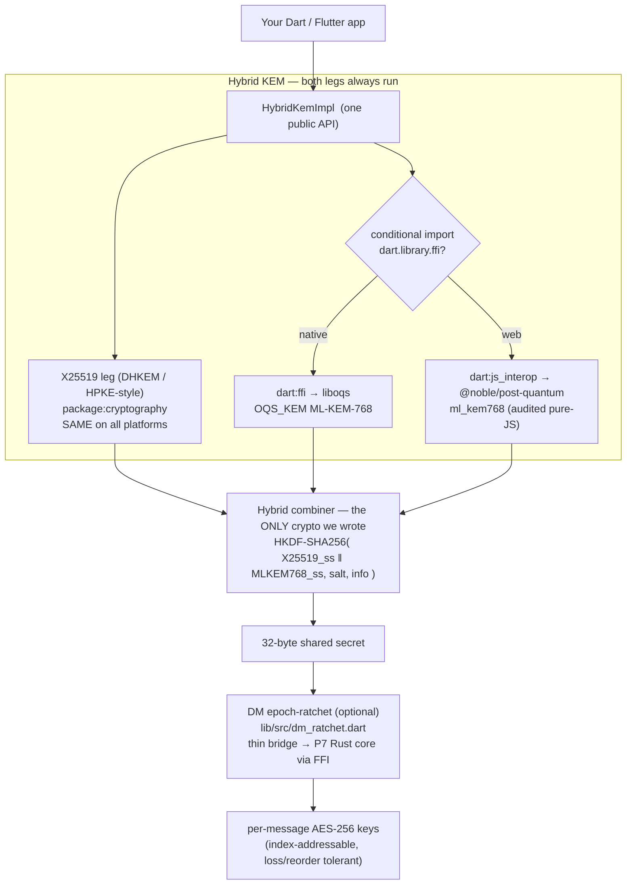
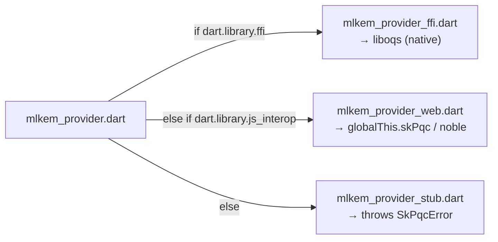
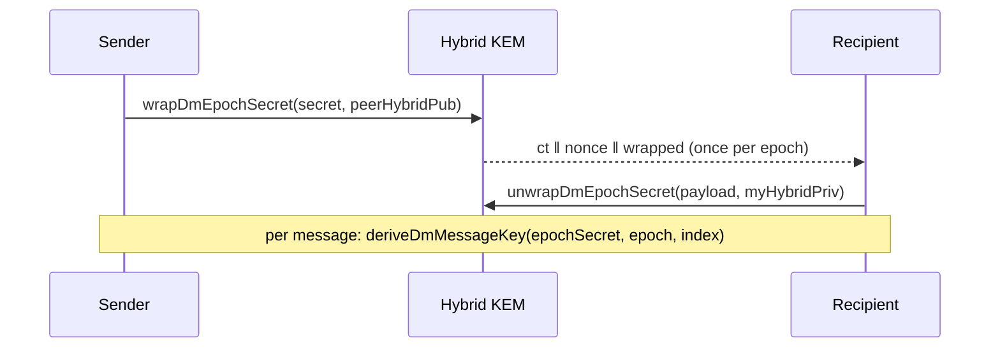

# sk_pqc — Architecture

> ⚠️ **Experimental · pre-1.0 · NOT independently security-audited.** A clean-room
> **reference implementation** — cross-impl-parity-verified against our Python
> (`sk-pqc`) and Rust (`sk-pqc`) builds, but with **no third-party security audit,
> fuzzing, or formal review**. It binds vetted libraries; the original code is the
> wiring. Review it yourself before production use.

`sk_pqc` is a **hybrid post-quantum key-encapsulation** library for Dart and
Flutter. It exposes **one** `HybridKem` API and runs the **same** suite —
**`x25519-mlkem768`** (X25519 + ML-KEM-768, FIPS 203) — on **web** and **native**
behind a compile-time conditional import. The **only** original cryptographic code
is the **HKDF-SHA256 hybrid combiner**; the lattice and curve primitives are
**bound, never hand-rolled**.

**Honest posture (non-negotiable):** this is **post-quantum / quantum-resistant**,
never "quantum-proof" or "quantum-safe." Hybrid means the derived secret is **secure
if *either* leg holds** — a quantum break of X25519 still leaves ML-KEM-768; a
lattice break of ML-KEM-768 falls back to classical X25519. We **combine**, never
replace. The package is **KEM-only** — signatures (ML-DSA / SLH-DSA) are out of
scope / future work; it authenticates nothing by itself.

---

## 1. Layered data flow



**Read this flow as:** both legs always execute; only the ML-KEM-768 leg's
*implementation* swaps between liboqs (native) and noble (web). The X25519 leg and
the HKDF combiner are identical bytes everywhere, so a misconfigured PQ backend
degrades to classical X25519 security rather than failing open — and the API throws
`SkPqcError` rather than silently downgrading.

---

## 2. Backend selection (conditional import)



| Target | ML-KEM-768 leg | X25519 leg | Supplied by you |
|---|---|---|---|
| **Native** (`dart:ffi`) | [liboqs](https://github.com/open-quantum-safe/liboqs) `OQS_KEM` | `package:cryptography` | the `liboqs` shared library at runtime |
| **Web** (`dart:js_interop`) | [`@noble/post-quantum`](https://github.com/paulmillr/noble-post-quantum) `ml_kem768` (audited pure-JS) | `package:cryptography` | `globalThis.skPqc` before app load |

> **The browser caveat (honest).** No browser's WebCrypto exposes a post-quantum KEM
> as of 2026, and a pure-Dart ML-KEM compiled to JS would not be a *vetted*
> implementation — so the web leg is delegated to the audited `@noble/post-quantum`
> JS library, which the page must supply. The classical X25519 leg is native Dart
> on every platform.

---

## 3. The hybrid combiner (the only original crypto)

```
shared_secret = HKDF-SHA256( IKM  = X25519_ss ‖ MLKEM768_ss,   // X25519 first
                             salt = "" (default),
                             info = "sk_pqc/x25519-mlkem768/v1",
                             L    = 32 )
```

- `‖` is byte concatenation, **X25519 part first**. **Concatenate-then-KDF. Never
  XOR. Never pure-PQ.**
- HKDF itself (RFC 5869) is `package:cryptography`, verified in tests against
  RFC 5869 §A.1 known answers.

### Wire format (interop contract — MUST NOT change)

| Element | Layout | Bytes |
|---|---|---|
| public key | `X25519_pub (32)` ‖ `MLKEM768_pub (1184)` | **1216** |
| private key | `X25519_priv_seed (32)` ‖ `MLKEM768_secret (2400)` | **2432** |
| ciphertext | `X25519_ephemeral_pub (32)` ‖ `MLKEM768_ct (1088)` | **1120** |
| shared secret | `HKDF-SHA256(...)` | **32** |

The same vector
([`test_vectors/hybrid_kem_x25519_mlkem768.json`](../test_vectors/hybrid_kem_x25519_mlkem768.json))
is verified by **Dart (native + web), liboqs, noble-post-quantum, and Python** — the
ML-KEM-768 leg is anchored to the NIST ACVP FIPS 203 keyGen seed (`d ‖ z`, tcId 26).

---

## 4. DM epoch-ratchet (optional layer) — a deliberate BRIDGE

`lib/src/dm_ratchet.dart` carries the **key schedule** for SKChat's 1:1 DM
epoch-ratchet (Level 3): one **epoch secret** is distributed per epoch over the
hybrid KEM, then per-message AES-256 keys are derived symmetrically and
index-addressably (loss/reorder tolerant). Periodic rekey (50 messages **or** 7
days) starts a fresh independent epoch — forward secrecy across the boundary,
post-compromise security within.



Fixed, cross-implementation HKDF labels:

```text
salt = "skchat/dm-epoch/"          ‖ u64_be(epoch)
info = "skchat/dm-ratchet/msg/v1/" ‖ u64_be(index)
key  = HKDF-SHA256(IKM = epoch_secret, salt, info, L = 32)
```

> **HONESTY — this layer is a BRIDGE, not its permanent home.** The long-term plan
> (P7) is for this ratchet key schedule to live **once** in the shared **Rust core**
> (`sk-pqc/src/ratchet.rs`) and be reached from Dart over **FFI** — exactly like the
> ML-KEM-768 leg already reaches liboqs — instead of a permanent hand-maintained
> Dart copy. Three parallel implementations (Python, Rust, Dart) of a
> security-critical schedule can silently drift, so this Dart code is deliberately
> **thin, clearly marked, and pinned to the same cross-language KAT vectors** as
> Python and Rust. When the Rust core exposes an FFI surface, these functions should
> collapse into a shim over it and the original Dart crypto here should be deleted.

---

## 5. Source map

| File | Role |
|---|---|
| `lib/sk_pqc.dart` | public surface (re-exports) |
| `lib/src/hybrid_kem.dart` | `HybridKem` abstract API + types |
| `lib/src/hybrid_kem_impl.dart` | `HybridKemImpl` — wires X25519 + ML-KEM + combiner |
| `lib/src/x25519_kem.dart` | X25519 DHKEM leg (`package:cryptography`) |
| `lib/src/combiner.dart` | HKDF-SHA256 hybrid combiner (the only original crypto) |
| `lib/src/mlkem_provider.dart` | conditional-import selector |
| `lib/src/mlkem_provider_ffi.dart` | native leg → liboqs over `dart:ffi` |
| `lib/src/mlkem_provider_web.dart` | web leg → `@noble/post-quantum` over `dart:js_interop` |
| `lib/src/mlkem_provider_stub.dart` | no-backend fallback (throws `SkPqcError`) |
| `lib/src/dm_ratchet.dart` | DM epoch-ratchet key schedule (bridge → Rust core) |
| `lib/src/types.dart` | key/ciphertext/secret value types + `SkPqcError` |

---

## Related projects / See also
- ⬇️ **Used by:** [skchat](https://github.com/smilinTux/skchat) / [skcomms](https://github.com/smilinTux/skcomms) — hybrid post-quantum DMs + envelope/DM KEM.
- ↔️ **Siblings (same suite, all import as `sk_pqc`):** PyPI [`sk-pqc`](https://pypi.org/project/sk-pqc/) ([sk-pqc-py](https://github.com/smilinTux/sk-pqc-py)) · crates.io [`sk-pqc`](https://crates.io/crates/sk-pqc) ([sk-pqc-rs](https://github.com/smilinTux/sk-pqc-rs)).
- 📐 **Standards:** [sk-standards](https://github.com/smilinTux/sk-standards) — crypto · data-flow · version · doc/SOP.
- 📖 **Procedures:** [SOP.md](../SOP.md) · [SECURITY.md](../SECURITY.md) · [CONTRIBUTING.md](../CONTRIBUTING.md).
